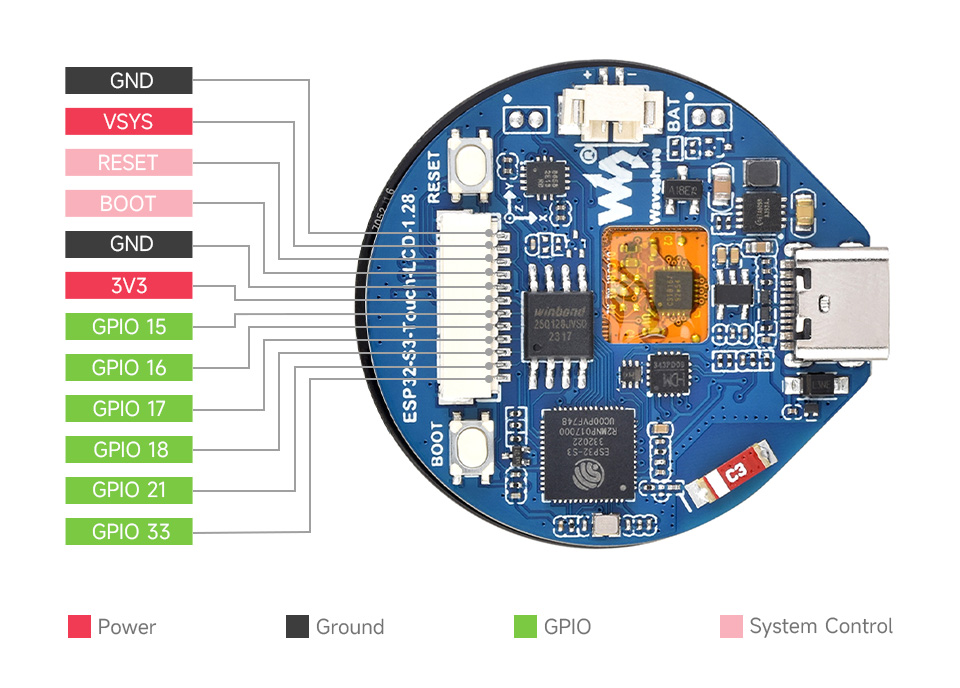

Board wiki: https://www.waveshare.com/wiki/ESP32-S3-Touch-LCD-1.28

Interfaces:

Pins:
| ESP32-S3R2 |    LCD   |  SH1.0 | MX1.25 | QMI8658 |    other   |
|:----------:|:--------:|:------:|:------:|:-------:|:----------:|
| GPIO0      |          |        |        |         | BOOT0      |
| GPIO1      |          |        | ADC    |         |            |
| GPIO2      | LCD_BL   |        |        |         |            |
| GPIO3      |          |        |        | INT2    |            |
| GPIO4      |          |        |        | INT1    | MOSFET1_CS |
| GPIO5      | TP_INT   |        |        |         | MOSFET2_CS |
| GPIO6      | TP_SDA   |        |        | SDA     |            |
| GPIO7      | TP_SCL   |        |        | SCL     |            |
| GPIO8      | LCD_DC   |        |        |         |            |
| GPIO9      | LCD_CS   |        |        |         |            |
| GPIO10     | LCD_CLK  |        |        |         |            |
| GPIO11     | LCD_MOSI |        |        |         |            |
| GPIO12     | LCD_MISO |        |        |         |            |
| GPIO13     | TP_RST   |        |        |         |            |
| GPIO14     | LCD_RST  |        |        |         |            |
| GPIO15     |          | GPIO15 |        |         |            |
| GPIO16     |          | GPIO16 |        |         |            |
| GPIO17     |          | GPIO17 |        |         |            |
| GPIO18     |          | GPIO18 |        |         |            |
| GPIO19     |          |        |        |         |            |
| GPIO20     |          |        |        |         |            |
| GPIO21     |          | GPIO21 |        |         |            |
| GPIO33     |          | GPIO33 |        |         |            |

